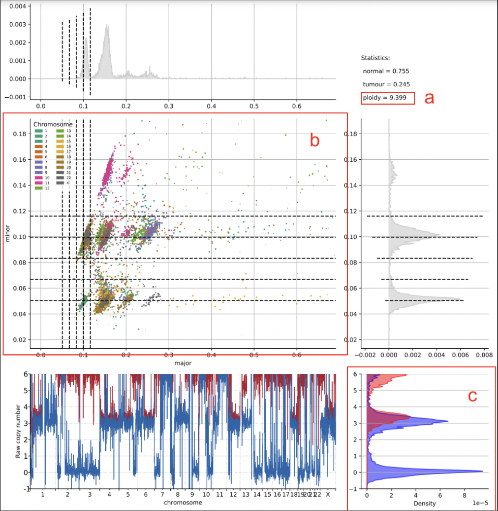
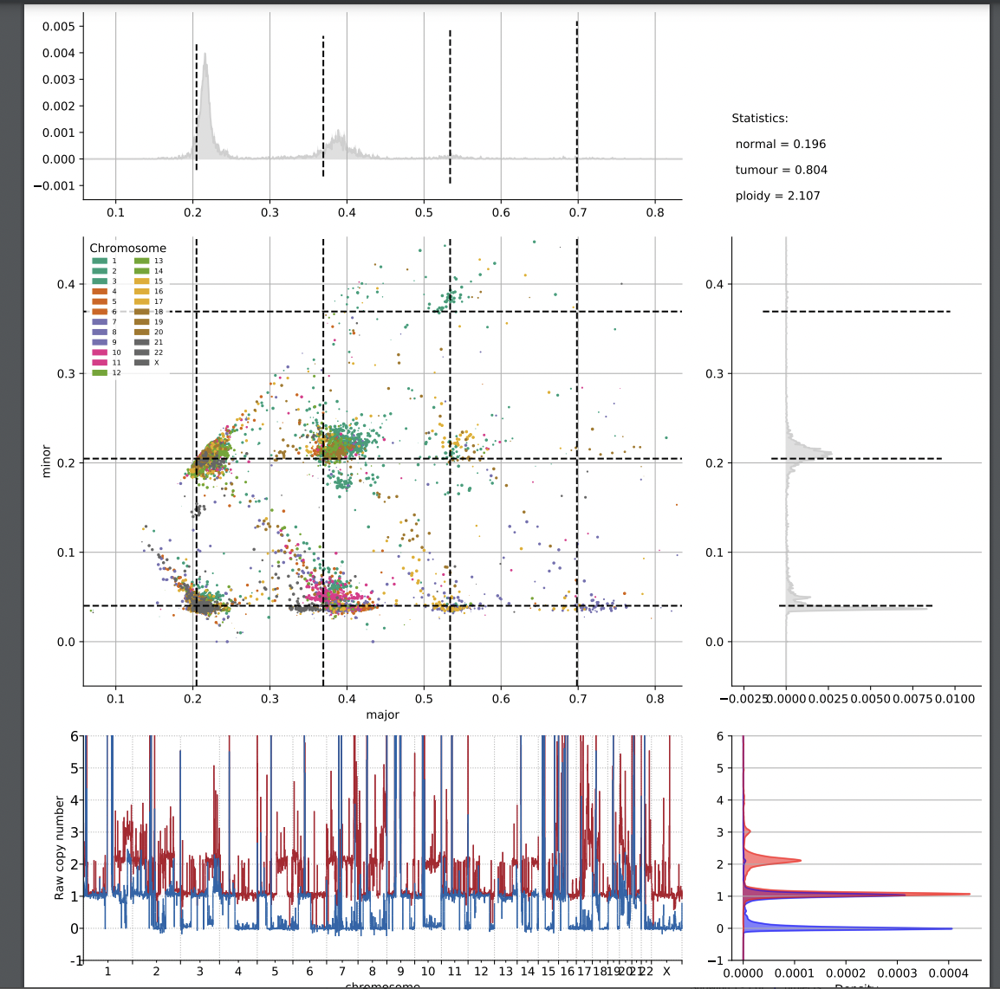
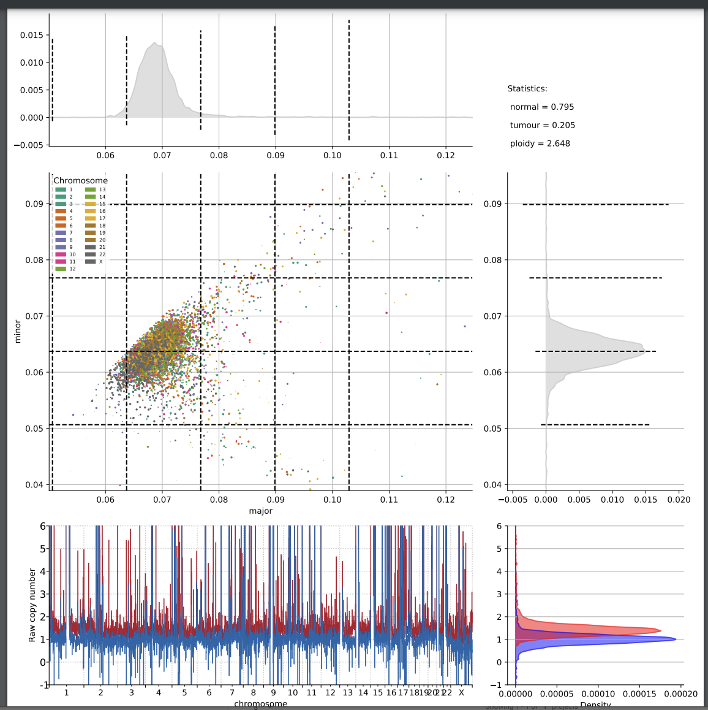
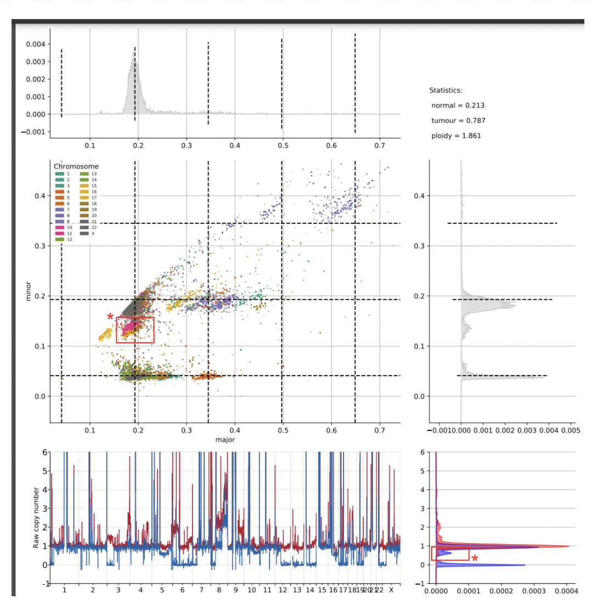
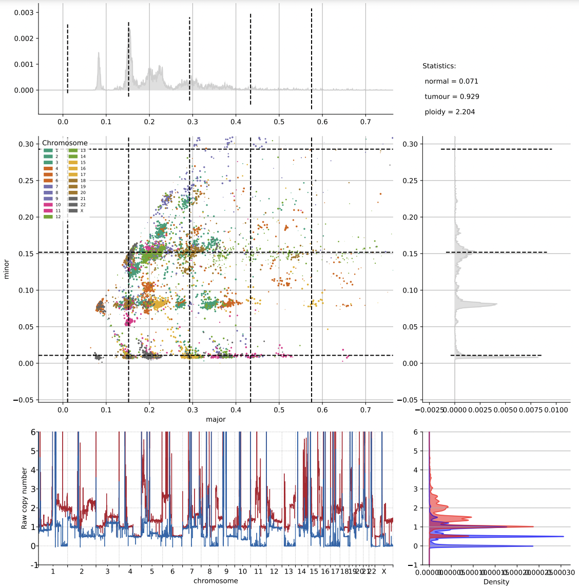
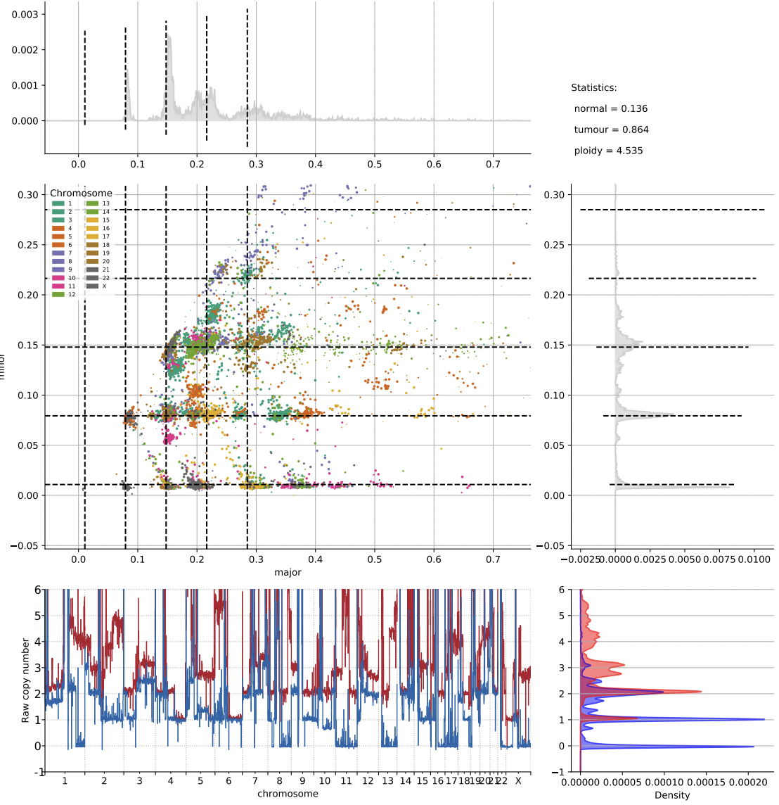
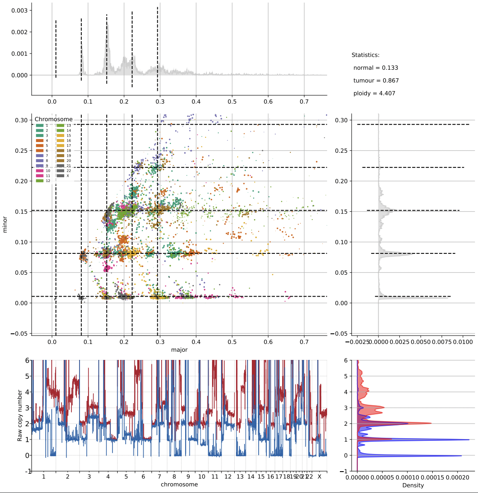
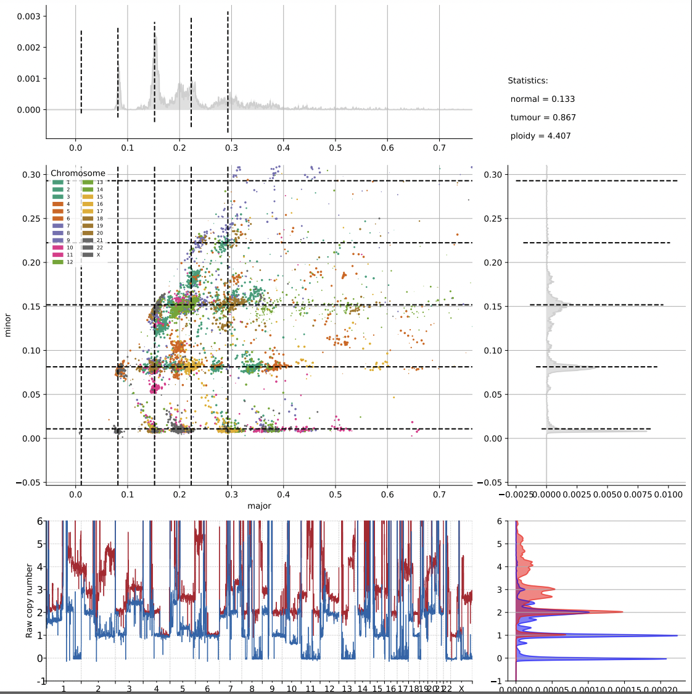
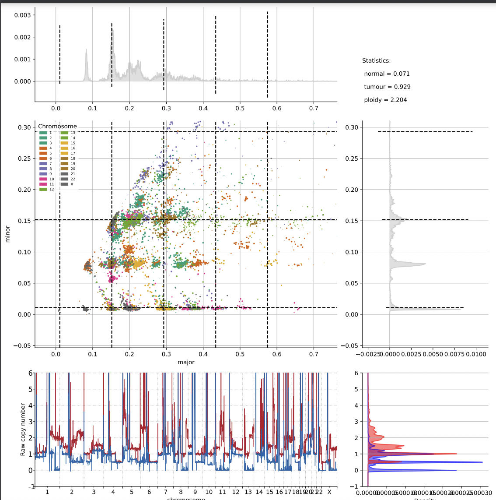

## Remixt Calling Interpretation
This guide describes how to select the best inferred ploidy solution from the 6-10 solutions the remixt pipelines generate in a run. 
This selection of the best solution is reffered to in this guide as **calling**.

As a general rule, the optimal solution is that which **minimizes** the ploidy while also giving a distribution of ploidy values that is most concentrated at **integer** numbers. 
This guide will also covers edge cases, such as when the ploidy solution is too low quality to call  or when there appears to be subclonality in the solution.

For a given sample, the file containing the remixt solutions is named `Ploidy Plots` and it is the only file used in this guide. 

### 1. A diagram of a single solution

<ol type="a">
  <li>Overall inferred ploidy</li>
  <li>major vs minor. An optimal solution typically has well-defined areas of concentrated ploidy.</li>
  <li>Density of ploidy. An optimal solution typically has peaks over integer values.</li>
</ol>

### Common types of solutions
1. A high quality solution
   
Notice all the values are highly concentrated over integers.
2. A low quality solutions
   
Notice that the distribution of ploidy is in one clump. If all the ploidy solutions for a sample look like this, then the sample effectively has an unknown ploidy.
3.Possible subclonality
      
Most of the values are aligned at integer values, but a small segment of the values are not. You should only choose a solution with like this
When there are no other reasonable solutions where the values all peak at integer numbers.

### Picking the right solution
Here we will go over some example solutions for an individual sample and explain which is the optimal solution.

*Sample 1*

**(a)**   

**(b)**  

**(c)** 

The solution is 4.407. Even though the first solution is the lowest, a large portion of the values are non-integer. The third solution is better than the second solution because both have a similar level of integer density but it is slightly lower.

*Sample 2*:

**(a)**   

**(b)**  

For this sample, there is not enough signal in any of the ploidy solutions to choose an answer.  

